# Trainer-card-Maker
# Pokemon Trainer Card

## Alunos
- Victor Lucas Tornelli
- Guilherme Rodrigues

Este projeto, **Pokemon Trainer Card**, é uma aplicação desenvolvida em **Java** que permite aos usuários criarem e gerenciarem seus próprios cartões de treinador Pokémon. Ele conta com uma interface gráfica intuitiva e funcionalidades como login, cadastro e gestão de cartões.

### Documentação de Projeto
- Pdf:


## Funcionalidades
- **Cadastro e login de usuários**
- **Criação e personalização de cartões de treinador**
- **Atualização e exclusão de cartões**
- **Visualização interativa dos cartões criados**
- **Exportação de cartão como imagem PNG**

## Tecnologias Utilizadas
- **Linguagem:** Java
- **IDE:** NetBeans (uso do GUI Builder)
- **Bibliotecas:** Swing, AWT, File IO
## Tecnologias Utilizadas
- **Linguagem:** Java
- **IDE:** NetBeans (uso do GUI Builder)
- **Bibliotecas:** Swing, AWT, File IO

## Estrutura do Projeto
```
PokemonTrainerCard/
|-- build.xml
|-- manifest.mf
|-- nbproject/            # Configurações do NetBeans
|-- src/
|   |-- pokemontrainercard/
|       |-- Models
|       |-- Views (.forms)
|       |-- Controllers
|      
|-- Database
|-- imagens/, pokesprites/, trainers/      # Recursos visuais
|
```

## Diagramas do Projeto

Os diagramas estão disponíveis na pasta [`diagramas/`](Artefatos/Diagram_images).

### Arquivos de Projeto (PlantUML, Draw.io, etc.)
Os arquivos-fonte dos diagramas estão disponíveis na pasta: [`diagramas/`](Artefatos/Diagram_files). Incluímos os seguintes modelos:

### Imagens dos Diagramas


#### Diagrama de Casos de Uso
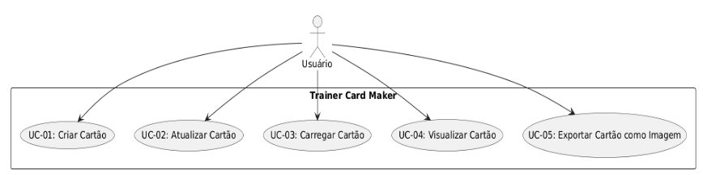

#### Diagrama de Classes
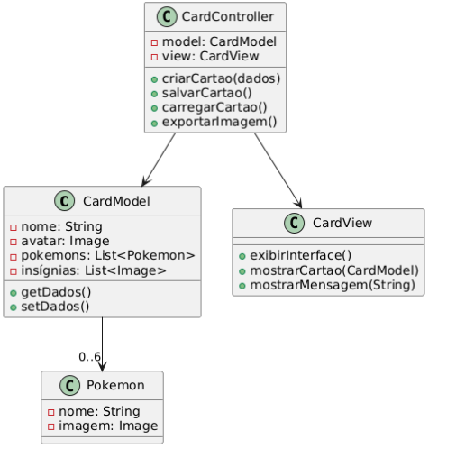

#### Diagrama de Sequência 
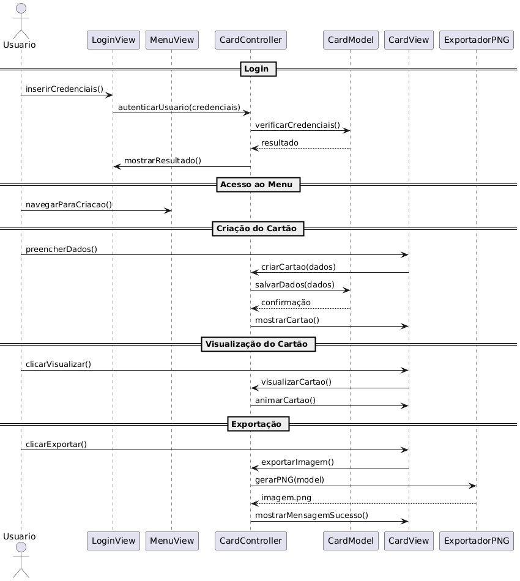

#### Diagrama de Componentes e implantação
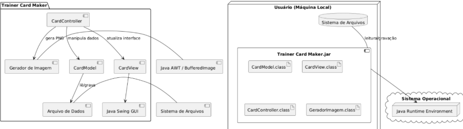

#### Diagrama de Comunicação
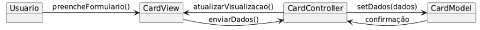

#### Diagrama de estados
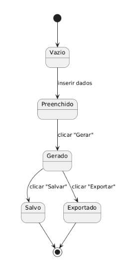

#### Diagrama Entidade-Relacionamento (DER)


## Licença
Este projeto está sob a licença [MIT](LICENSE).

## Imagens do Projeto

### Menu Principal
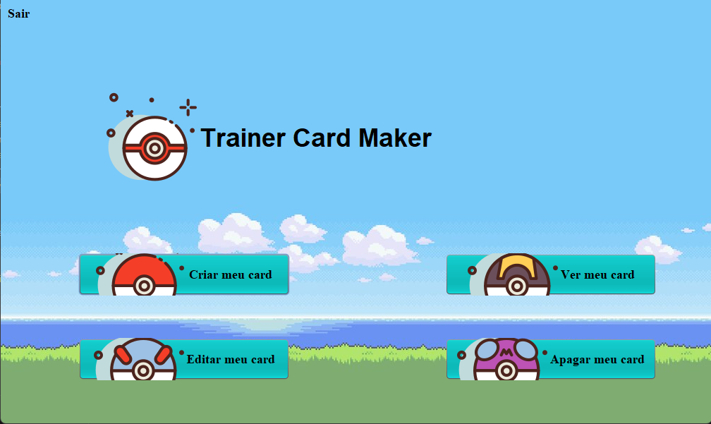

### Tela de Criação
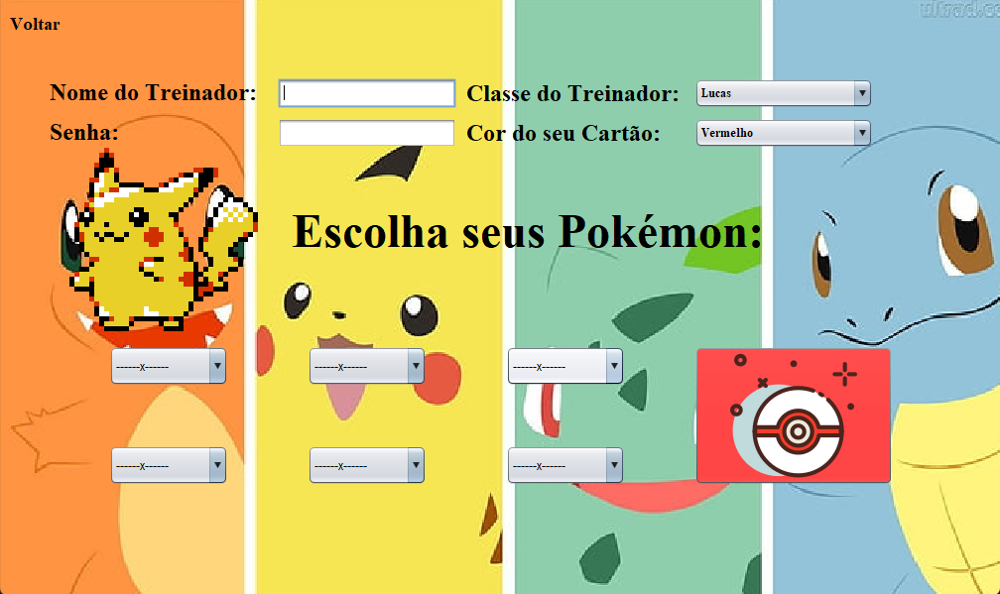

### Tela de Atualização
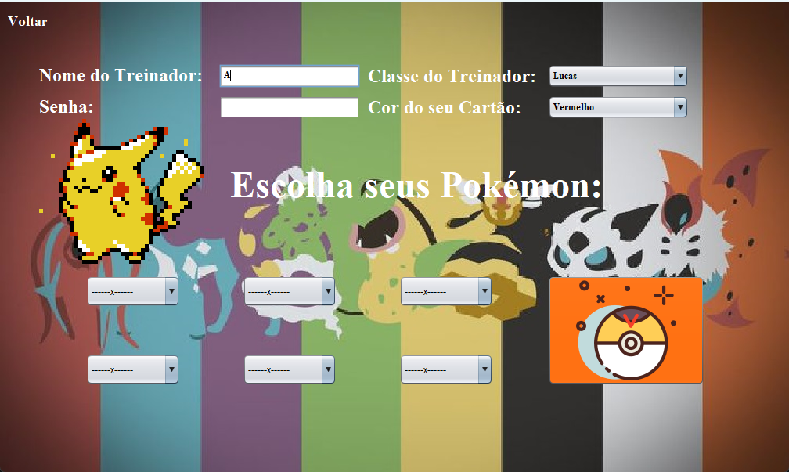

### Tela de Leitura
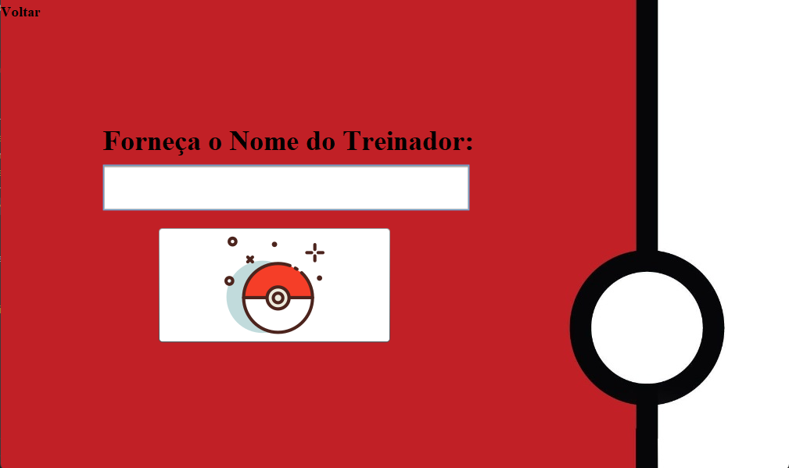

### Tela de Visualização
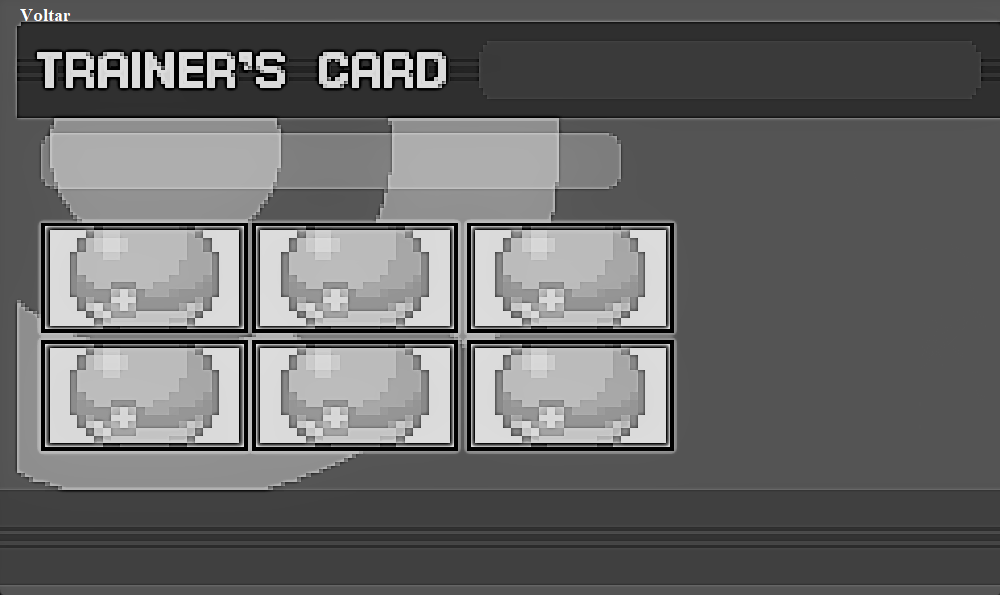

### Tela de Exclusão
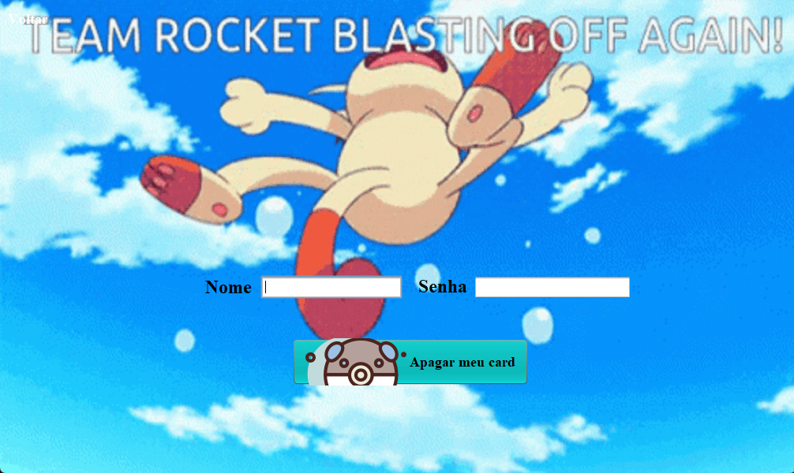
