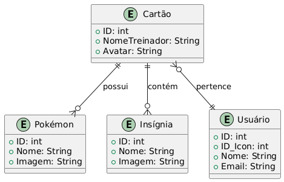

# Trainer-card-Maker
# Pokemon Trainer Card

## Alunos
- Victor Lucas Tornelli
- Guilherme Rodrigues

Este projeto, **Pokemon Trainer Card**, é uma aplicação desenvolvida em **Java** que permite aos usuários criarem e gerenciarem seus próprios cartões de treinador Pokémon. Ele conta com uma interface gráfica intuitiva e funcionalidades como login, cadastro e gestão de cartões.

### Documentação de Projeto
- Pdf:[`Trabalho 2`](https://github.com/Viihctor/TCM/blob/main/Artefatos/Trabalho%202%20-%20Documenta%C3%A7%C3%A3o%20de%20Projeto.pdf).


## Funcionalidades
- **Cadastro e login de usuários**
- **Criação e personalização de cartões de treinador**
- **Atualização e exclusão de cartões**
- **Visualização interativa dos cartões criados**
- **Exportação de cartão como imagem PNG**

## Tecnologias Utilizadas
- **Linguagem:** Java
- **IDE:** NetBeans (uso do GUI Builder)
- **Bibliotecas:** Swing, AWT, File IO
## Tecnologias Utilizadas
- **Linguagem:** Java
- **IDE:** NetBeans (uso do GUI Builder)
- **Bibliotecas:** Swing, AWT, File IO

## Estrutura do Projeto
```
PokemonTrainerCard/
|-- build.xml
|-- manifest.mf
|-- nbproject/            # Configurações do NetBeans
|-- src/
|   |-- pokemontrainercard/
|       |-- Models
|       |-- Views (.forms)
|       |-- Controllers
|      
|-- Database
|-- imagens/, pokesprites/, trainers/      # Recursos visuais
|
```

## Diagramas do Projeto

Os diagramas e suas iamgens estão disponíveis na pasta [`Artefatos/`](/Artefatos). Incluímos os seguintes modelos:

### Imagens dos Diagramas

#### Diagrama de Casos de Uso


#### Diagrama de Classes


#### Diagrama de Sequência – Criar Cartão


#### Diagrama de Sequência – Atualizar Cartão


#### Diagrama de Sequência – Carregar Cartão


#### Diagrama de Sequência – Visualizar Cartão


#### Diagrama de Sequência – Exportar Imagem
![UC-05]Artefatos/Diagram_images/sequencia_UC05_exportar_imagem.png)

#### Diagrama Entidade-Relacionamento (DER)


### Arquivos de Projeto (PlantUML, Draw.io, etc.)

## Imagens do Projeto

### Menu Principal


### Tela de Criação


### Tela de Atualização


### Tela de Leitura


### Tela de Visualização


### Tela de Exclusão

